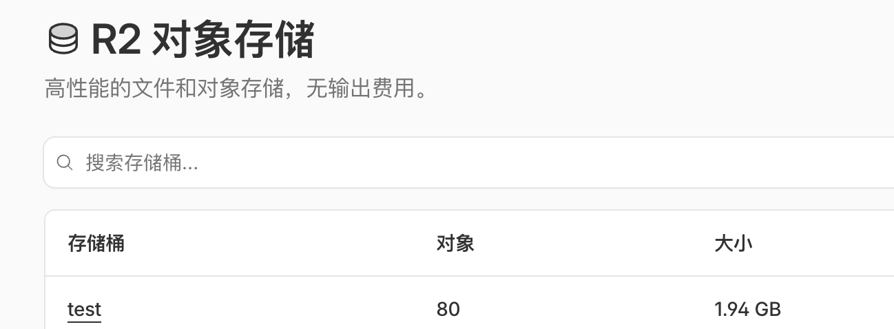

# 阿里云多节点代理场景

## 场景说明

该场景会在阿里云批量部署多台基于 shadowsocks-libev 的代理节点，默认创建 10 台抢占式 ECS，并通过 redc 插件链生成 Clash 配置。适合快速拿到一组可批量接入的代理出口。

部署完成后，你会得到节点公网 IP 列表、批量 SSH 连接命令，以及本地生成的 Clash 配置文件；如果已经配置 R2 上传能力，还可以把配置文件自动上传到 Cloudflare R2 后再分发使用。

## 前置条件

- 本地 redc 已配置可用的阿里云凭据。
- 该场景只支持 `cn-beijing`（北京）和 `ap-northeast-1`（东京）两个区域。
- 场景默认使用抢占式实例，需接受节点数量和可用性可能受库存影响。
- 如果希望自动上传 Clash 配置到 R2，请提前安装并配置 `rclone`，并准备好 Cloudflare R2 存储桶。
- 如果不配置 R2 上传，场景仍可正常使用，只是需要在本地查看插件生成的 Clash 配置文件。

## 快速使用

```bash
redc pull aliyun/proxy
redc run aliyun/proxy
redc run aliyun/proxy -e node=20
redc status [uuid]
redc stop [uuid]
```

默认会创建 10 台节点；如需切换区域或覆盖配置文件名，也可以这样启动：

```bash
redc run aliyun/proxy \
  -e region=ap-northeast-1 \
  -e node=10 \
  -e filename=team-aliyun.yaml
```

## 参数说明

| 参数名 | 是否必填 | 默认值 | 示例 | 行为影响 |
|--------|----------|--------|------|----------|
| `region` | 否 | `cn-beijing` | `ap-northeast-1` | 控制部署区域；当前仅支持北京和东京，且两个区域会使用不同的硬编码机型与可用区。 |
| `instance_name` | 否 | `proxy` | `team-proxy` | 控制节点实例名称前缀。 |
| `node` | 否 | `10` | `20` | 控制代理节点数量，数量越多，成本和可用出口数也会相应增加。 |
| `port` | 否 | `60001` | `60010` | 控制 Shadowsocks 服务端口，同时影响生成的 Clash 配置内容。 |
| `password` | 否 | `O9E3b1/OdxCrLkTmWyTL7w==` | `StrongProxyPass123` | 控制代理认证密码，同时影响生成的配置文件。 |
| `filename` | 否 | `aliyun-config.yaml` | `team-aliyun.yaml` | 控制本地或上传后的 Clash 配置文件名。 |
| `buckets_name` | 否 | `test` | `proxy-config` | 仅在启用 R2 上传时使用，决定上传目标存储桶。 |
| `buckets_path` | 否 | `/proxyfile/` | `/shared/aliyun/` | 仅在启用 R2 上传时使用，决定上传路径前缀。 |
| `instance_password` | 否 | 自动生成 | `YourPassword123!` | 控制所有节点的 SSH 登录密码；留空时模板会自动生成。 |

## 输出说明

- `public_ip` / `ecs_ip`：代理节点公网 IP 列表，可用于快速盘点节点是否都已拉起。
- `ssh_commands`：批量 SSH 登录命令，便于逐台节点检查服务状态。
- `ssh_user`：默认 SSH 用户名，当前为 `root`。
- `ecs_password` / `ssh_password`：所有节点共用的 SSH 登录密码。
- Clash 配置文件：由 `redc-plugin-clash-config` 根据 `port`、`password`、`filename` 生成；如果配置了 R2 上传，还会由上传插件进一步分发。

## 常见问题

- 如果没有配置 R2 上传，场景仍可正常使用，直接查看本地生成的 Clash 配置文件即可。
- 如果启动失败，优先排查以下几项：
	1. 与阿里云 API 的网络连接是否超时。
	2. 目标区域是否还有可用抢占式实例容量。
	3. `rclone` 配置是否正确。
	4. R2 存储桶名称或路径配置是否一致。
	5. 当前账户余额是否足以创建节点。

## 注意事项

- 模板在不同区域使用硬编码的实例规格与可用区：北京默认 `ecs.n1.tiny` / `cn-beijing-f`，东京默认 `ecs.t5-lc1m1.small` / `ap-northeast-1b`。
- `main.tf` 中已启用 `spot_strategy = "SpotWithPriceLimit"`，因此节点稳定性和最终节点数量可能受市场价格与库存影响。
- 默认安全组会放开全部 TCP 和 UDP 入站流量，部署后请按你的场景自行收紧。

## 附录

- 在 redc 场景执行链路中，Clash 配置由 `redc-plugin-clash-config` 生成，R2 上传由 `redc-plugin-upload-r2` 负责；`deploy.sh` 中的 `upload_to_r2` 更适合独立 Terraform 使用时参考。
- 如需启用 R2 上传，请先安装并配置 `rclone`：
	- https://github.com/rclone/rclone/releases
	- https://dash.cloudflare.com/ 的 R2



```text
rclone config
s3
Cloudflare R2 Storage
xxxxxxxxxxxxx
xxxxxxxxxxxxxxxxxxxxxxxxxxxxxxxxxxxxxxx
https://xxxxxxxxxxxxxxxxxx.r2.cloudflarestorage.com
auto

rclone lsf r2:test
```

- 如需独立使用 `deploy.sh`，也可以调整其中 `upload_to_r2` 函数输出的配置下载 URL，例如：

```text
echo "url : https://这里改成你的 r2 地址/proxyfile/aliyun-config.yaml"
```
