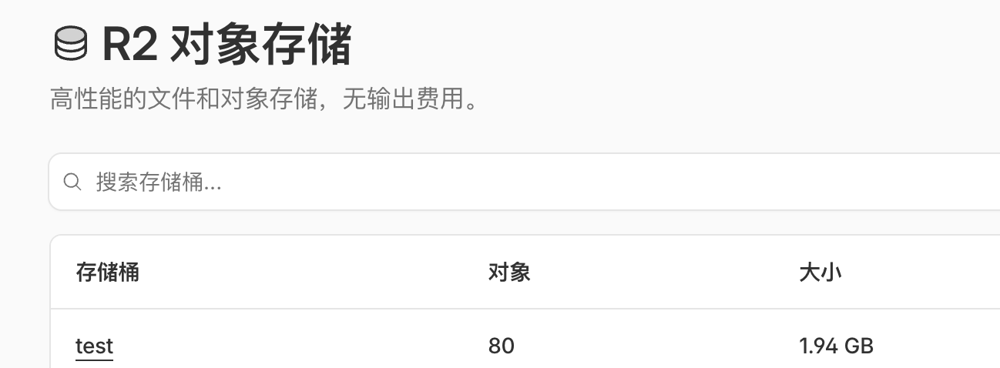

# Usage

1. Configure according to the notes before use (if empty, no configuration needed)
2. Usage commands are as follows:

Pull
```
redc pull aliyun/proxy
```

Start
```
# Default 10 nodes
redc run aliyun/proxy

# Customize number of nodes via -e parameter, e.g., 10 nodes
redc run aliyun/proxy -e node=10
```

Query
```
redc status [uuid]
```

Stop
```
redc stop [uuid]
```

3. If R2 upload is not configured, you can view the clash configuration file locally

# Notes

**R2 Configuration**

The upload_to_r2 function in deploy.sh is responsible for uploading clash configuration to R2

Please install rclone and configure rclone with R2 yourself
- https://github.com/rclone/rclone/releases
- https://dash.cloudflare.com/ r2



```
rclone config
s3
Cloudflare R2 Storage
xxxxxxxxxxxxx
xxxxxxxxxxxxxxxxxxxxxxxxxxxxxxxxxxxxxxx
https://xxxxxxxxxxxxxxxxxx.r2.cloudflarestorage.com
auto

rclone lsf r2:test
```

**You can replace the configuration download link in the upload_to_r2 function in deploy.sh yourself**

Corresponding to
```
echo "url : https://your-r2-address-here/proxyfile/aliyun-config.yaml"
```

**Spot Instances**

Already configured in main.tf
```
spot_strategy              = "SpotWithPriceLimit"
```

If starting the scenario fails, possible reasons:
1. Aliyun account balance is insufficient (needs to be greater than 200)
2. Network connection to Aliyun API timed out
3. Aliyun region sold out or instance_type configuration discontinued
4. rclone configuration is incorrect
5. R2 bucket name and configuration are inconsistent
