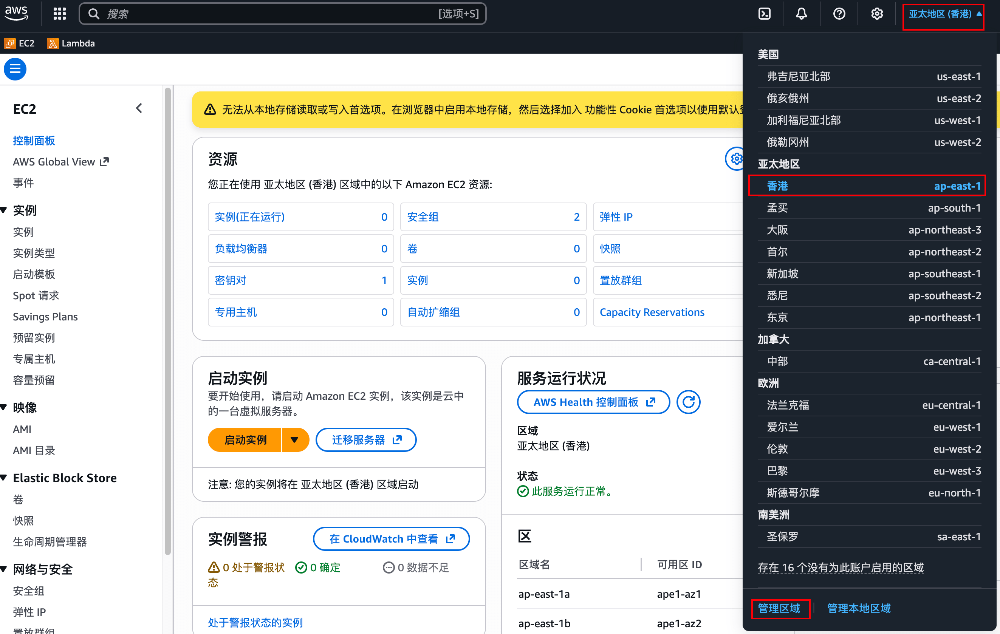
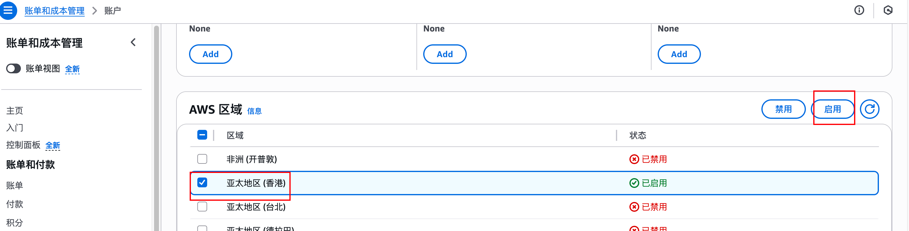

# Usage

1. **Must** configure according to the notes before use (if empty, no configuration needed)
2. Usage commands are as follows:

Pull
```
redc pull aws/dnslog
```

Start
```
redc run aws/dnslog -e domain=dnslog.com

# domain is your dnslog domain
```

Query
```
redc status [uuid]
```

Stop
```
redc stop [uuid]
```

3. If Cloudflare API is not configured, you need to manually modify the CNAME after the scenario is created

# Static Resources

You can replace the static resource download links in the template yourself

**dig.pm Configuration**
- https://github.com/yumusb/DNSLog-Platform-Golang

You can use my compiled version (no difference, you can also compile the original)
- https://github.com/No-Github/pdnslog/releases/tag/v1.0.0

# Notes

**Region Configuration**

Enable AWS ap-east-1 (Hong Kong) region





**CF Configuration**

Apply for API token

Configure similar to below (ip can be any value first)(add ns1 to domain)
```
# A ns1 1.2.34
# NS a ns1.dnslog.com
```

**redc config.yaml Configuration**

Configure your CF email and accesskey in config.yaml

If starting the scenario fails, possible reasons:
1. Network connection to AWS API timed out
2. AWS region sold out or instance_type configuration discontinued
3. AMI architecture does not match instance_type
4. CF DNS configuration is incorrect
5. CF key permissions are insufficient
