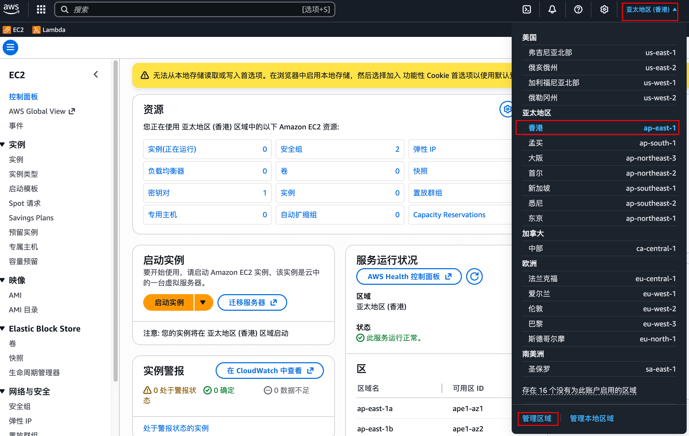
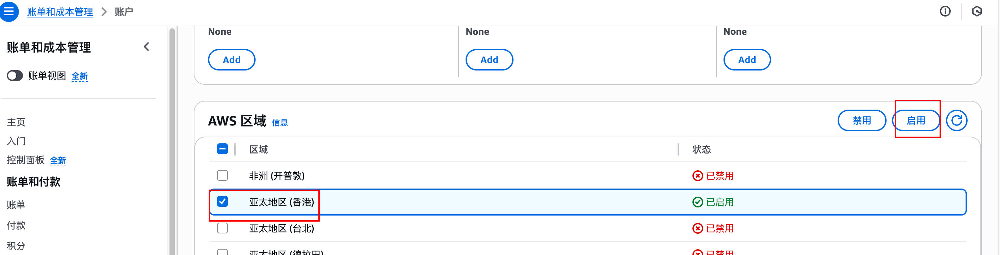

# 场景使用

1. 使用前请 **一定** 按照注意事项里内容进行配置 (若空则无需配置)
2. 使用时命令如下

拉取
```
redc pull aws/docker
```

开启
```
redc run aws/docker
```

查询
```
redc status [uuid]
```

关闭
```
redc stop [uuid]
```

# 注意事项

**区域配置**

aws 开启 ap-east-1 (香港) 区域





tmux 中可看安装进度

若启动场景报错，可能原因
1. 与 aws api 网络连接超时
2. aws 该区域售罄或下架 instance_type 的配置机型
3. AMI 架构与 instance_type 不匹配
