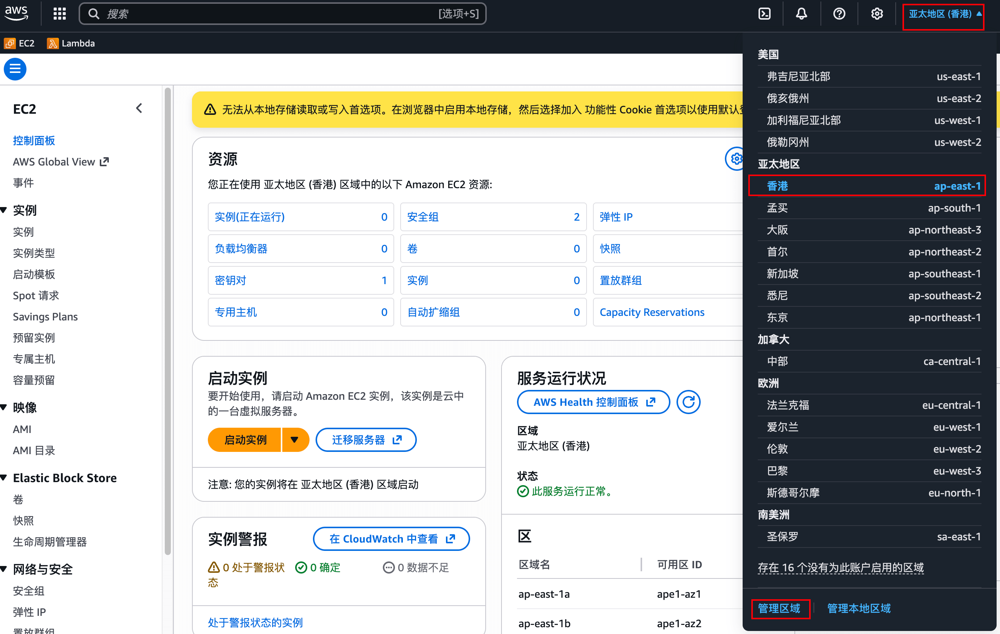
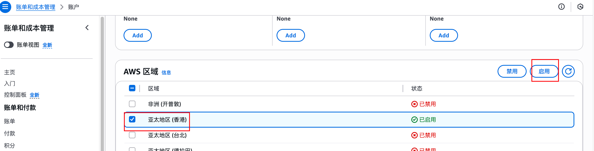

# Interactsh 场景

## 场景说明

该场景会在 AWS ap-east-1 区域部署一台 interactsh-server，适合做带外探测、盲打验证和交互式回连测试。

部署完成后，你会得到实例公网 IP、SSH 连接命令，以及可配合 `https://app.interactsh.com/` 使用的服务域名；如果已经配置 Cloudflare 凭据，当前插件会尝试自动更新 `ns1.<主域>` 的 A 记录，但其他解析关系仍需你按实际部署方式确认。

## 前置条件

- 需要可用的 AWS 凭据，并确保已开通 ap-east-1（香港）区域。
- 该模板使用 ARM64 架构实例，需确保当前账号在该区域可以创建对应实例。
- 需要准备一个用于 interactsh 的域名。
- 如果希望 redc 辅助更新 DNS，请在 `redc config.yaml` 中配置 Cloudflare 的邮箱和 access key / API 凭据；当前自动化主要覆盖 `ns1.<主域>` 的 A 记录。
- 如果不配置 Cloudflare API，也可以在部署完成后手动补 DNS 记录。

## 快速使用

```bash
redc pull aws/interactsh
redc run aws/interactsh -e domain=interactsh.example.com
redc status [uuid]
redc stop [uuid]
```

其中 `domain` 需要替换成你自己的 interactsh 域名。

## 参数说明

| 参数名 | 是否必填 | 默认值 | 示例 | 行为影响 |
|--------|----------|--------|------|----------|
| `domain` | 是 | 无 | `interactsh.example.com` | 用于部署 interactsh 服务时绑定的域名，也是后续在客户端或 Web 页面接入时使用的核心参数。 |

## 输出说明

当部署输出会驱动用户下一步操作时，建议优先关注以下字段：

- `web_link`：固定为 `https://app.interactsh.com/`，用于接入 interactsh Web 客户端。
- `web_domain`：你实际部署并绑定的 interactsh 域名，后续在客户端配置时会用到。
- `public_ip` / `ecs_ip`：实例公网 IP，可用于手动配置 DNS、联通性检查或其他排障。
- `ssh_command`：直接给出 SSH 连接命令，便于登录实例查看服务状态。
- `ssh_private_key_path`：本地生成的私钥路径，配合 `ssh_command` 使用。

## 常见问题

- 如果没有配置 Cloudflare API，部署完成后需要手动补 DNS 记录，确保域名可以正确指向当前实例。
- 即使已经配置 Cloudflare 凭据，当前插件默认也只会更新 `ns1.<主域>` 的 A 记录；其他解析关系仍建议手动核查。
- 如果启动失败，优先排查以下几项：
	1. 与 AWS API 的网络连接是否超时。
	2. ap-east-1 区域是否还有可用实例容量。
	3. AMI 架构与实例规格是否匹配。
	4. Cloudflare DNS 配置是否正确。
	5. Cloudflare 凭据权限是否足够。

## 注意事项

- 该场景固定使用 ap-east-1（香港）区域，使用前先确认区域已启用。





## 附录

- 模板内静态资源下载链接可按需自行替换。
- `interactsh-server` 发行版本可参考：
	- https://github.com/projectdiscovery/interactsh/releases
