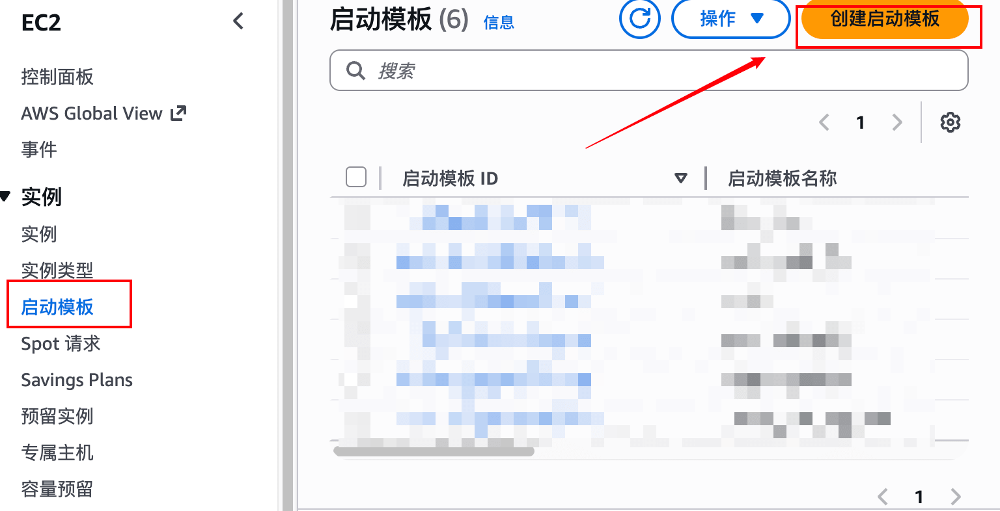

# 场景使用

1. 使用前请 **一定** 按照注意事项里内容进行配置 (若空则无需配置)
2. 使用时命令如下

拉取
```
redc pull aws/md
```

开启
```
redc run aws/md
```

查询
```
redc status [uuid]
```

关闭
```
redc stop [uuid]
```

# 静态资源

可自行替换模板中的静态资源下载链接

**docker-compose.yml 配置**
- https://github.com/No-Github/Archive/releases/download/1.0.8/docker-compose.yml

# 注意事项

**区域配置**

aws 开启 ap-east-1 (香港) 区域


**launch_template 配置**

自行替换 main.tf 中的 launch_template id 值



这个按你场景需求进行修改

```
launch_template {
        id = "这个改成你的 launch_template id 值"
    }
```

若启动场景报错，可能原因
1. 未替换 main.tf 中的 launch_template id 值
2. 与 aws api 网络连接超时
3. aws 该区域售罄或下架 instance_type 的配置机型
4. 启动模板中的安全组未开放公网访问
5. f8x 自动安装 docker 失败
